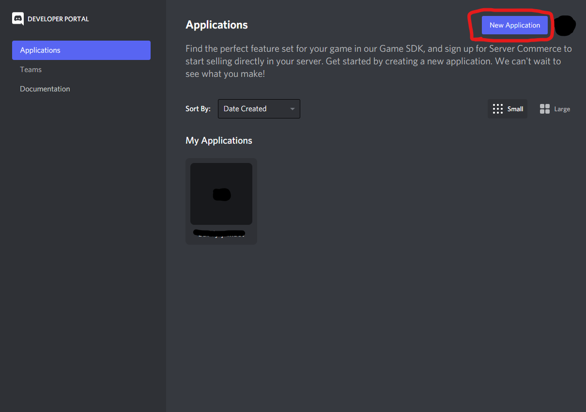
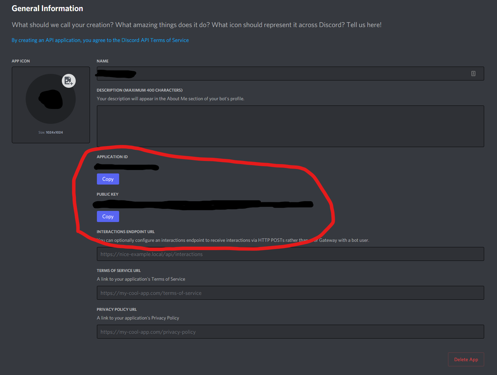
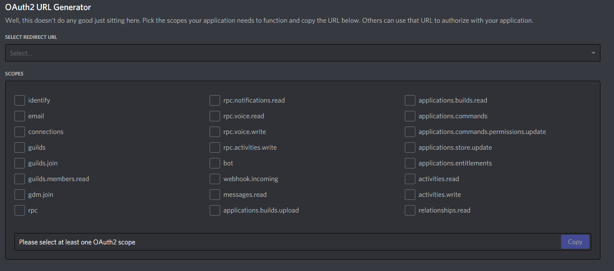
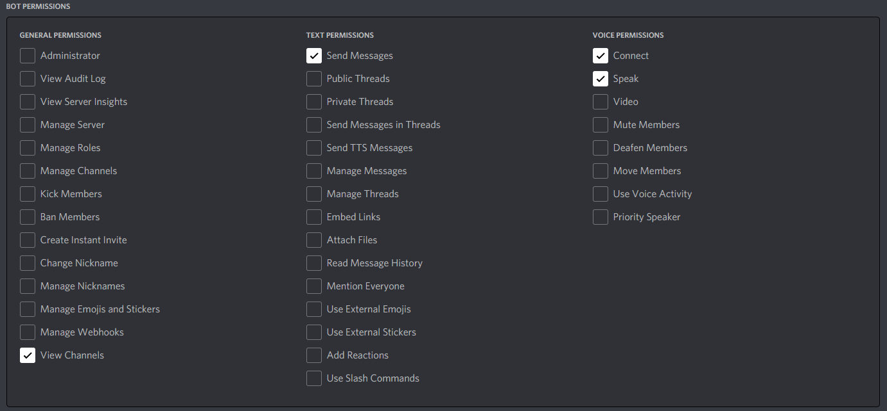

# Discord Music Bot

Music bot for discord written in **Javascript** for **Node** servers.
Has capability to play music during voice chat, including a web interface with plans to allow full web interface functionality to control the queue. Funtionality includes ability to order, play, shuffle and clear the queue.

# Reqiurements
* Node - version 16 or greater
* npm

> you can install the required node modules by changing directory to the servers and installing with:
>> **npm install**

# Setup

## Step 1, discord setup

Setup a new application in the discord developer portal. You can name the bot however you wish.

## Step 2 

Once the bot is made you will need the Public Key and Application ID from the general information.
This is required for bot functionality.

## Step 3

Now you need to invite your bot to your server, you will need to go to the OAuth2 tab and create a Url to invite the bot.
The bot permission will need to be selected:

Additionally in the Bot Permissions that show up after you select bot you will need to select the following permissions:

* View Channels allows the bot to view the commands when sent in a channel.
* Send messages allows the bot to send notifications to a channel to let you know what song is playing.
* Voice permissions are required to let the bot play music in the voice channel.

Once the bot is invited to the server you now just need to have the server running the bot to play the music.

## step 4, server setup

First you need to clone the repository to the server you are using to run the bot.
Once you have and extracted the folder contents, you can run npm to install dependencies

> **npm install**

After that you need to setup the config file, there are three things to change:
* prefix - you can set this to whatever symbol you want, i have it setup as ! for commands i.e. !play
* token - this is the public key gotten in step 2
* ClientID - this is the Application ID from step 2

After that, you can edit the server.js file.

The file is setup for https encryption. You can generate your own encryption using certbot, a good example of how to do this can be found here https://itnext.io/node-express-letsencrypt-generate-a-free-ssl-certificate-and-run-an-https-server-in-5-minutes-a730fbe528ca.

You just need to update the following lines to instead point to your proper files after generating them.

const privateKey = fs.readFileSync('/absolute/to/your/privateKey', 'utf8');
const certificate = fs.readFileSync('/absolute/to/your/cert', 'utf8');
const ca = fs.readFileSync('/absolute/to/your/centralauthority', 'utf8');

Now you should be able to run your bot server by using either of:

> **sudo node server.js**

> **sudo nodemon server.js**

